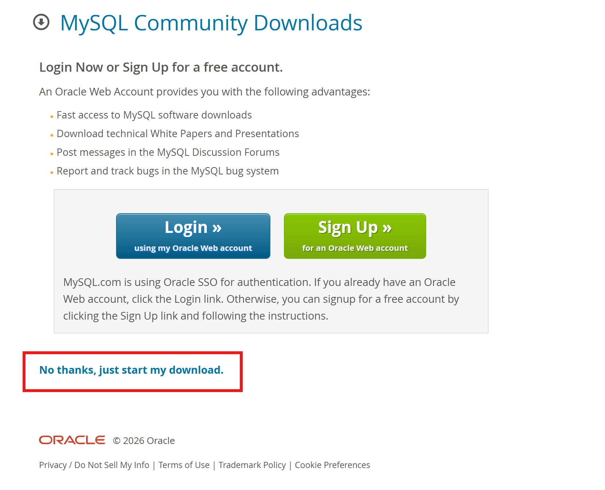
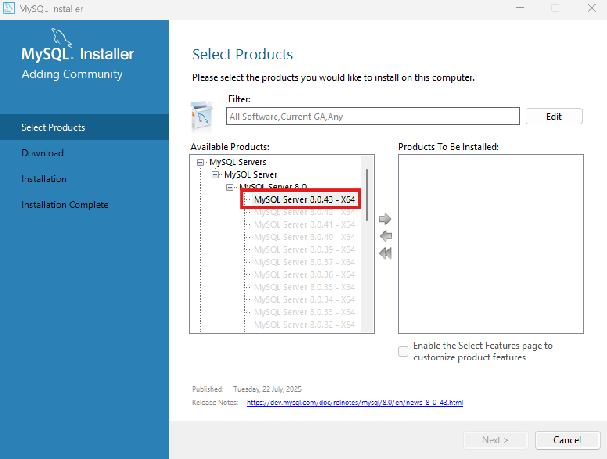
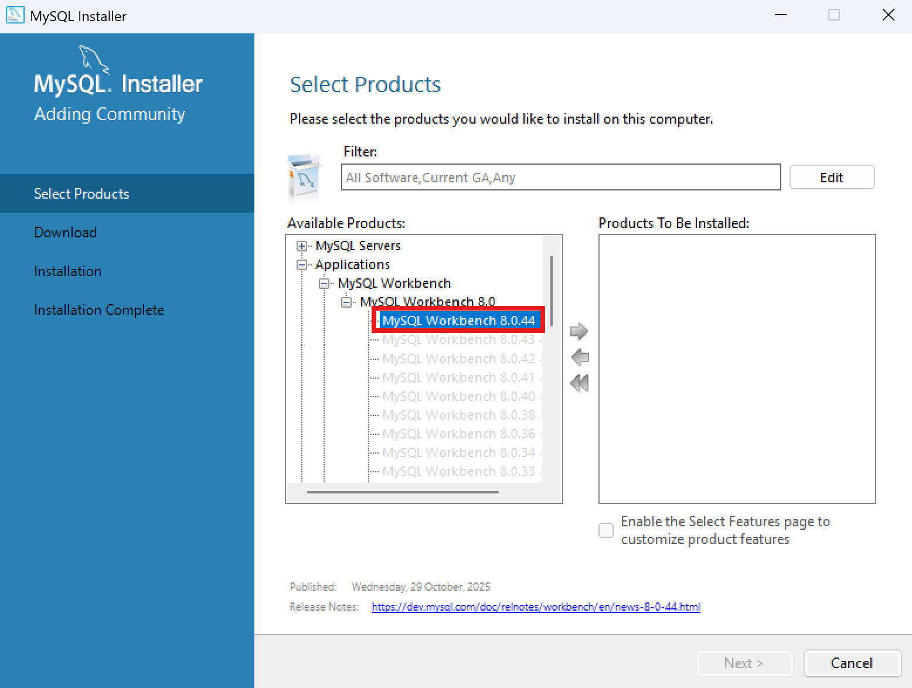
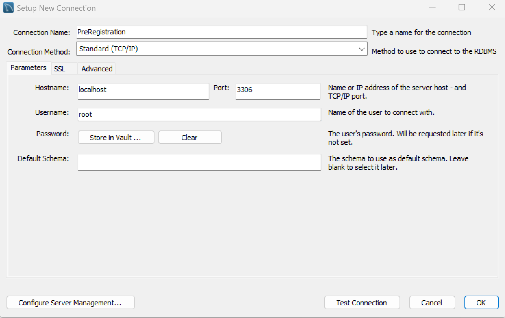
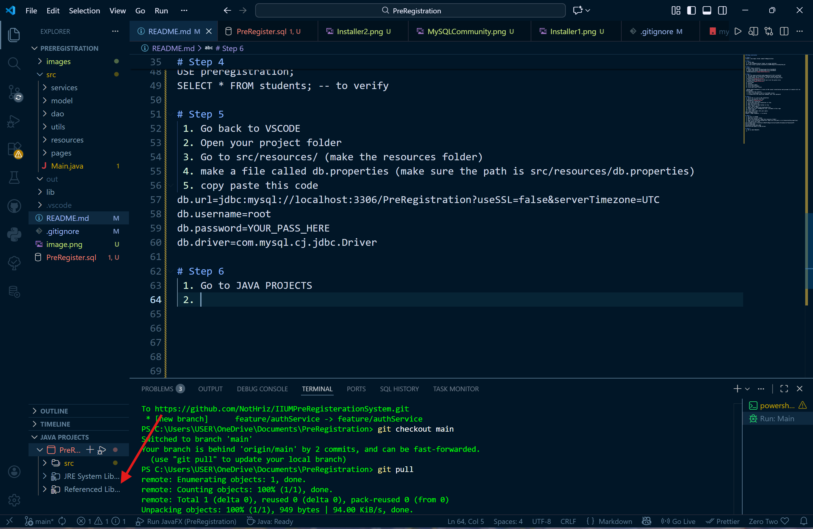

# Setup instructon

### Step 0
Create a new empty folder named PreRegistration

### Step 1
 1. clone repo 
 2. in the PreRegistration folder run using terminal:
 git clone https://github.com/NotHriz/IIUMPreRegistrationSystem.git

### Step 2
 install these installer:
 1. https://dev.mysql.com/downloads/file/?id=546178
 2. https://dev.mysql.com/downloads/file/?id=546163
 

### Step 3
 1. Run the mysql-installer-web-community-8.0.44.0 installer
 2. Proceed with the installation (Choose Custom Setup Type)
 3. Choose MySQL Server 8.0.43 - x64 and click the green arrow
 
 4. Choose MySQL Workbench 8.0.44 and click the green arrow
 
 5. Click Next
 6. Execute
 7. Click Next Again
 8. Click Execute Again
 9. Click next until finish

 !INCASE MySQL Workbench is stuck at 86% cancel installation and proceed (it should still be downloaded)
  1. Open back the intaller
  2. Click (reconfigure) next to the MySQL server
  3. Proceed with the setup and remember your root password

### Step 4
 1. Click the (+) icon in My connection
 2. Set it up exactly like this
 
 3. Click Test Connection
 4. Click Okay once Test Connection is fine
 5. Open the Connection
 6. Find "Server" in the toolbar on top
 7. Click "Data Import"
 8. Make sure to check Self-Contained File
 9. Choose the file "PreRegister.sql" included in this repo
 10. Start Import
 11. Copy these codes into your query:
USE preregistration;
SELECT * FROM students; -- to verify

### Step 5
 1. Go back to VSCODE
 2. Open your project folder
 3. Go to src/resources/ (make the resources folder)
 4. make a file called db.properties (make sure the path is src/resources/db.properties)
 5. copy paste this code
db.url=jdbc:mysql://localhost:3306/PreRegistration?useSSL=false&serverTimezone=UTC
db.username=root
db.password=YOUR_PASS_HERE
db.driver=com.mysql.cj.jdbc.Driver
 
### Step 6
 1. Go to JAVA PROJECTS
 2. Click Refrenced Library (+) plus icon

 3. Go to MySQL Connector
 4. Choose the JAR Field (mysql-connector-j-9.5.0)

### Step 7 
 1. Run Main.java (Use "Run Java" dont simply press the play button)

# Error Codes Guide
500 : Database error
101 : Course not found
102 : Prerequisite not met
103 : Course already preregistered
104 : Exceeds maximum credit hours
105 : Section capacity full
106 : Schedule conflict
0   : Success

 

 

